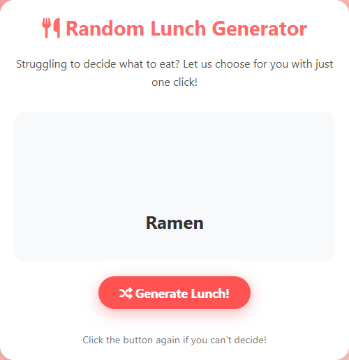
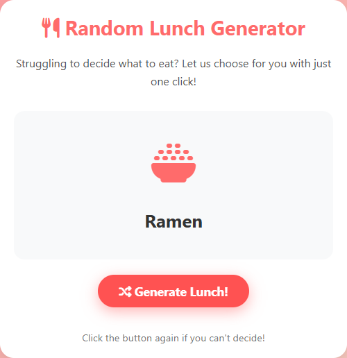
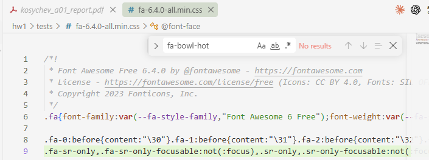
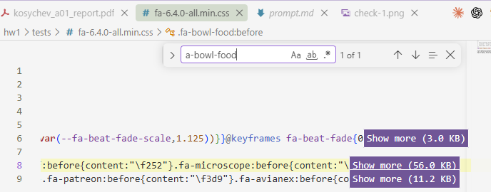

# Why Lunch Icons Disappear: Debugging Hallucinated Font Awesome Classes in an AI-Generated Web App

Student: Aleksei Kosychev &nbsp;&nbsp; Team: Individual 
Email: amkosychev@edu.hse.ru &nbsp;&nbsp; Date: 2026-09-16 
Assignment: A01 — Random Lunch Generator, web app scaffold (Week 1)

## Abstract

The course starter app "Random Lunch Generator" sometimes shows a dish name with an empty box
instead of its icon. I traced the bug in the given prompt and code and found that 3 of the 12 menu
items use Font Awesome class names (`fa-bowl-hot`, `fa-pasta`, `fa-bowl`) that do not exist in the
loaded Font Awesome 6.4.0 Free stylesheet. A headless Chrome test showed 9/12 icons rendered before the fix
and 12/12 after it, and the blank rate over 10,000 simulated clicks dropped from 24.9% (theory: 3/12 = 25%) to 0%.
The takeaway is that LLM-written code can use icon names that look real but are not in the library, and "sometimes" bugs
in random apps are often a fixed defect hit with some probability.

*Index Terms* — AI-assisted debugging, Font Awesome, hallucinated API, prompt correction, web app

## 1. Introduction

**Problem statement.** The Week 1 homework provides a prompt (`week1/prompt.md`) and the resulting
single-file app (`week1/index.html`) from the course repository [1]. The TODO on the lecture slide is to
understand and fix "the issue of images sometimes not displaying". The instructor asked us to fix the
given code and prompt, not to write a new version from scratch.

**Motivation.** This app is the base for later assignments ("random → AI-personalized"), so a
visual defect would carry over. The exercise also trains a team skill: reading someone else's
AI-generated prompt and code and finding where the AI was wrong.

**Concrete example.** Click "Generate Lunch!" → the random pick is Ramen → the card shows the text
"Ramen" above an empty grey area (Fig. 1, left). Clicking again → Pizza → the icon is shown normally.

**Contributions.**

- Root cause with evidence: three non-existent icon classes, which give a blank icon with probability 3/12.
- A minimal fix to the given `index.html` and `prompt.md` (diffs in the repository), checked with an automated browser test.

## 2. Related Work

References used (full list at the end): the course starter repository [1]; the exact
Font Awesome 6.4.0 stylesheet the app loads [2]; the Font Awesome icon search with the Free filter [3];
MDN documentation of `getComputedStyle` and `::before` [4], [5]; Playwright for Python [6].

**Alternatives considered.**

- *Emoji instead of icons* — no dependency, but it redesigns the given app instead of fixing it.
- *Local images (`assets/food-icons/` from the README)* — the files do not exist; out of scope.
- *Self-hosting Font Awesome* — avoids CDN outages, but does not fix wrong class names.

## 3. Method

**Approach.** I did not rewrite the app. I (i) read the prompt and code to find how an icon gets to
the screen, (ii) checked every class name used against the stylesheet that the page actually loads, (iii) measured
rendering in a real browser, and (iv) applied the smallest change to the code and to the prompt that removes
the cause, plus a safety fallback.

**Pipeline.** `lunchMenu[i].icon` (string) → `innerHTML = <i class="fas fa-…">` →
Font Awesome CSS rule `.fa-…:before { content: "\fXXX" }` → glyph from the webfont.
If no CSS rule matches, `::before` has `content: none`, the `<i>` has 0 px width and nothing is drawn — and there is no error
in the console. This is why the bug is silent.

**Tools & libraries.** Font Awesome Free 6.4.0 via cdnjs [2]; Google Chrome 152.0.7977.84 (headless);
Playwright for Python 1.58.0 [6]; Python 3.12; Claude Code 2.1.273 (VS Code extension) with Claude Opus 5.

**Key design decisions.**

- *Replace the class names, keep the design.* Ramen → `fa-bowl-rice`, Pasta → `fa-plate-wheat`,
  Soup → `fa-bowl-food`. All three exist in 6.4.0 Free. Font Awesome has no noodle or pasta icon, so these are the closest existing ones.
- *Add a runtime fallback.* After an icon is inserted, the page checks `getComputedStyle(icon, '::before').content` [4];
  if it is `none`, it shows `fa-utensils`. A future wrong name then shows a generic icon, not a blank box.
- *Fix the prompt, not only the code.* The prompt never fixed the icon library version and never asked to check
  that icons exist, so a new generation could bring the bug back. The corrected `prompt.md` fixes Font Awesome 6.4.0 Free,
  asks for a table of icon classes checked against the CSS, requires the fallback, and makes the README match the real
  single-file structure (it listed `style.css`, `script.js`, `assets/` and `LICENSE.md`, none of which exist).
- *Old names left as they are:* `fa-hamburger` and `fa-random` are Font Awesome 5 names, but 6.4.0 still defines them as aliases
  (`.fa-burger:before,.fa-hamburger:before` in [2]), so they render and I did not change them.
- *Secondary fix:* `clearTimeout` of the pending timer, so a fast second click does not briefly show the old result.

**Configuration.** Test viewport 600×700; wait 1100 ms per pick (500 ms delay + 500 ms fade-in);
item *i* is forced by replacing `Math.random` with `() => (i + 0.5) / 12`; Monte-Carlo seed 42, 10,000 clicks.
Command: `python tests/check_icons.py`.

## 4. Experiments

**Setup.** Both `starter/index.html` (unchanged copy of commit `d8a178a` of [1]) and `fixed/index.html` are opened
from disk in headless Chrome with the live cdnjs stylesheet. For each of the 12 items the script records the
`::before` content and the width of the `<i>`. A separate script check searches for every `fas fa-*` class in the downloaded CSS file.

**Results.**

| Item | Starter class | Starter | Fixed class | Fixed |
|---|---|---|---|---|
| Pizza, Sushi, Burger, Salad, Tacos, Sandwich, Curry, Steak, BBQ | (unchanged) | 9 × OK | (unchanged) | 9 × OK |
| Ramen | `fa-bowl-hot` | **blank** (`none`, 0 px) | `fa-bowl-rice` | OK (`\ue2eb`, 64 px) |
| Pasta | `fa-pasta` | **blank** (`none`, 0 px) | `fa-plate-wheat` | OK (`\ue55a`, 64 px) |
| Soup | `fa-bowl` | **blank** (`none`, 0 px) | `fa-bowl-food` | OK (`\ue4c6`, 64 px) |
| **Rendered / blank rate (10,000 clicks)** | | **9 / 12, 24.91 %** | | **12 / 12, 0 %** |

<em>Fig. 1. The same pick (Ramen) before (left, empty icon area) and after the fix (right). Screenshots from the test script.</em>

**Comparison vs. baseline.** The starter fails on exactly the three items whose classes are missing from the
CSS. The class search gives the same three names: `bowl`, `bowl-hot`, `pasta`. So the measured
24.91% matches the expected 3/12 = 25% (the difference comes from sampling). After the fix, no classes are missing and all 12 items render.

**Verification.**

- *Fallback test:* the fixed page was loaded again with Ramen changed back to `fa-bowl-hot`. The page showed
  `fa-utensils` (rendered), so the fallback works.
- *Timer race test:* click Pizza, then Sushi 100 ms later, and read the label 550 ms after the first click.
  Starter shows the stale "Pizza"; the fixed version shows "Thinking...". Both end on "Sushi".
- *Cross-check against the CSS:* the code point measured for Pizza (`\f818`) is the same as
  `.fa-pizza-slice:before{content:"\f818"}` in the stylesheet.
- The three missing names are also absent from the latest Font Awesome Free (7.3.1, jsDelivr), so a
  version update would not fix the bug either.

## 5. Discussion

**Failure case.** Starter, pick = Ramen: `<i class="fas fa-bowl-hot">`, computed `::before` content
`none`, width 0 px, no console error. The card shows only the text "Ramen".

**Root cause.** The code that shows the icon is correct. The data is wrong: three class names in `lunchMenu`
look like real Font Awesome names but are not defined in the loaded version. The prompt asked for "a
relevant icon or image" without fixing a version or asking for a check, so the model invented
plausible names — the "hallucinated API" failure mode. The word "sometimes" comes only from `Math.random()`:
the defect is always there, and a user hits it on 1 of 4 clicks.

**Fix + verification.** Detection: per-item browser test (9/12) and CSS class search (3 missing names) →
change: three class names, `::before` fallback, `clearTimeout`, corrected prompt → confirmation: 12/12, 0% blank, fallback and timer tests pass (Section 4).

**What worked.**

- Forcing each index instead of clicking at random: it turns a "sometimes" bug into a repeatable 12-row table.
- Reading computed `::before` content: it shows the real cause directly, which a screenshot alone does not.

**What surprised me / didn't work.**

- A missing Font Awesome class fails silently: no 404 and no console warning, because an unmatched CSS selector is not an error.
- My first automatic class check wrongly reported the fixed page as broken: it also matched the old names in my own code comment. I limited it to real `fas fa-*` class strings.
- Some existing icons still fit poorly (Steak → chicken drumstick, Tacos → spoon). They render, so this is about content quality, not this bug.

**Next improvement.** Add a CDN-failure fallback: if the Font Awesome stylesheet does not load, the
`::before` check fails for every item. The page could then switch to emoji or a self-hosted copy of the icons, so it
still shows a picture offline.

## 6. AI Usage Disclosure

**AI tools used.** Claude Code 2.1.273 (VS Code extension), model Claude Opus 5, one session (see
`kosychev_a01_session.json`).

**How AI was used.**

- *Search / reading:* extracting the task from the lecture slides and guidelines; cloning [1] and reading `week1/`.
- *Debugging:* checking icon classes against the downloaded CSS; writing and running the Playwright test.
- *Code generation:* the edits to `fixed/index.html` and `fixed/prompt.md`; the report build script.
- *Docs:* the first draft of this report.

**What I personally verified.**

- Ran the original version (`starter/index.html`, built from the original prompt) locally and confirmed that the bug is real:
  Ramen, Pasta and Soup appear without an icon.
- Ran the fixed version (`fixed/index.html`) locally, clicked until I got these three dishes, and confirmed that each of them now shows an icon.
- Opened the stylesheet `tests/fa-6.4.0-all.min.css` myself and searched for the old name `fa-bowl-hot`: no results
  (Fig. 2, left). Searching for the new name `fa-bowl-food` gave 1 result, the rule `.fa-bowl-food:before` (Fig. 2, right).
- Read the whole report and made small corrections and additions.
- Deployed the fixed app to GitHub Pages: https://ak1232320.github.io/rec-sys-hw1/ (code: https://github.com/ak1232320/rec-sys-hw1).

<em>Fig. 2. Manual check in the Font Awesome 6.4.0 CSS: <code>fa-bowl-hot</code> — no results (left); <code>fa-bowl-food</code> — 1 of 1 (right).</em>

**What I trusted without verification.** That the Monte-Carlo loop in `check_icons.py` models the page
correctly (it reuses the per-item results rather than clicking 10,000 times in the browser); the Chrome and
Playwright versions printed by the script.

**Session log.** `kosychev_a01_session.json` is the unmodified Claude Code log of this work.

## References

[1] S. Jin, "RecSys-LLMs: Recommender Systems course repository (week1: prompt.md, index.html)," GitHub, 2025. [Online]. Available: https://github.com/dryjins/RecSys-LLMs. [Accessed: 2026-09-16].

[2] Fonticons, Inc., "Font Awesome Free 6.4.0 — all.min.css," cdnjs. [Online]. Available: https://cdnjs.cloudflare.com/ajax/libs/font-awesome/6.4.0/css/all.min.css. [Accessed: 2026-09-16].

[3] Fonticons, Inc., "Font Awesome icon search," [Online]. Available: https://fontawesome.com/search. [Accessed: 2026-09-16].

[4] Mozilla Developer Network, "Window: getComputedStyle() method," MDN Web Docs. [Online]. Available: https://developer.mozilla.org/en-US/docs/Web/API/Window/getComputedStyle. [Accessed: 2026-09-16].

[5] Mozilla Developer Network, "::before," MDN Web Docs. [Online]. Available: https://developer.mozilla.org/en-US/docs/Web/CSS/::before. [Accessed: 2026-09-16].

[6] Microsoft, "Playwright for Python — Installation," Playwright Docs. [Online]. Available: https://playwright.dev/python/docs/intro. [Accessed: 2026-09-16].
