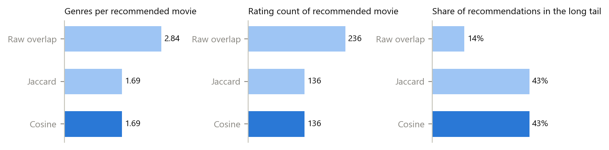
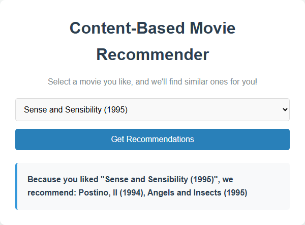
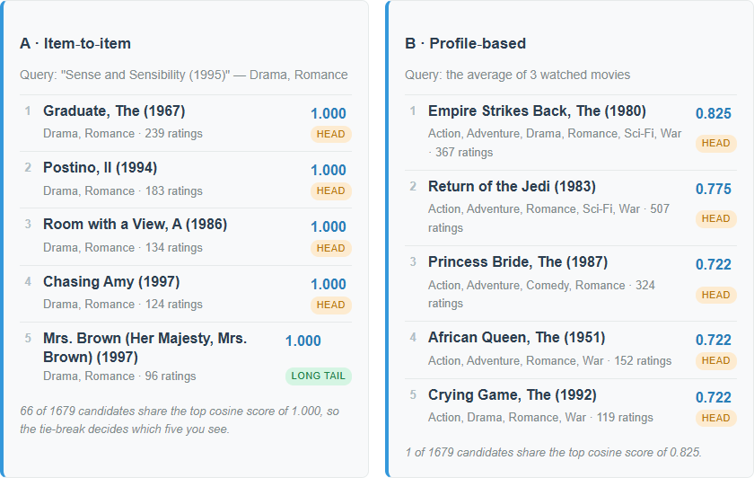
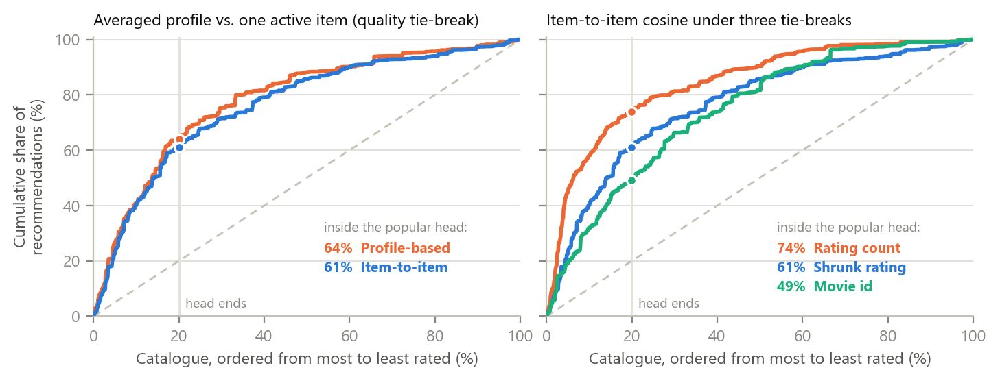
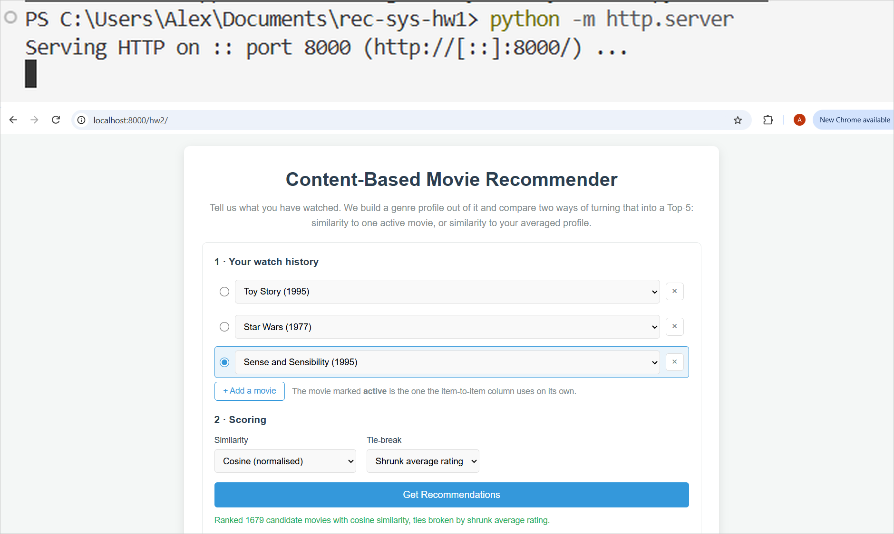

# One Movie or a Whole Profile? Cosine Similarity, Tie-Breaks and Long-Tail Discovery in a Content-Based Movie Recommender

Student: Aleksei Kosychev &nbsp;&nbsp; Team: Individual 
Email: amkosychev@edu.hse.ru &nbsp;&nbsp; Date: 2026-09-22 
Assignment: A02 — Content-Based Movie Recommender, MovieLens 100k (Week 2)

## Abstract

The Week 2 task is to replace the starter's naive Jaccard matching with cosine similarity, to build a user
profile by averaging several watched movies, and to return a Top-5. I did that and then measured what each
change buys, over all 1,682 movies and 940 real MovieLens users. Three results stand out. First, the
starter mislabels the genres of **100% of the movies**: it zips 18 genre names against 19 genre flags, so
every label is shifted by one and Toy Story is stored as a *Crime* film. Second, what removes the
multi-genre blockbuster bias is *normalisation*, not cosine specifically — the unnormalised dot product
recommends movies with 2.84 genres and 236 ratings on average, cosine 1.69 and 136, but cosine and Jaccard
return **the identical Top-5 for all 1,680 queries**, so cosine's real payoff is that it accepts a
real-valued profile vector, which Jaccard cannot score at all. Third, 126 movies on average tie at the top
cosine score, so the tie-break rule, not the similarity measure, picks the list the user sees: switching it
moves long-tail share from 24% to 57%. Profile-based ranking beats item-to-item on hit-rate@5 (46.5% vs
38.4%) while being slightly *more* head-leaning — it improves relevance, not discovery.

*Index Terms* — content-based filtering, cosine similarity, user profile, popularity bias, long tail, MovieLens

## 1. Introduction

**Problem statement.** The course provides a prompt and a four-file web app that recommends movies from
MovieLens 100k by Jaccard similarity on genre sets, returning the Top-2 for one selected movie [1]. The
assignment asks to (i) replace the naive matching with cosine similarity, (ii) build a profile vector by
averaging several watched titles and return a Top-5, and (iii) analyse item-to-item vs profile-based
ranking, the effect of normalisation on multi-genre blockbusters, and which approach surfaces long-tail
catalogue better. Those three questions are stated as business claims, and a screenshot cannot settle them,
so the app runs both modes side by side on the same watch history and the same scoring rules are
re-implemented offline in Python to measure them over the whole catalogue.

**Concrete example.** Watch history = Toy Story (1995), Star Wars (1977), Sense and Sensibility (1995),
the last one active. Item-to-item returns five Drama/Romance films *all scoring exactly 1.000* and ignores
the other two tastes; the averaged profile returns The Empire Strikes Back (0.825), Return of the Jedi
(0.775), The Princess Bride (0.722) — a blend, with strictly decreasing scores (Fig. 2).

**Contributions.** (i) Cosine similarity, an averaged profile vector and a Top-5 with an explicit,
deterministic tie-break, written as pure functions that the offline evaluation and the browser test share.
(ii) Two data bugs found in the starter and fixed: a genre off-by-one that corrupts every movie, and a
`\r`-truncated last field that deletes the Western genre on a Windows checkout. (iii) An offline evaluation
over 1,680 query movies and 940 users that answers the three analysis questions with numbers, plus a
28-check browser test pinning the live UI to the offline reference lists.

## 2. Related Work

Sources: the course starter [1]; the MovieLens 100k dataset and its README, which documents the 19 genre
fields and the `u.genre` ordering [2], [3]; Aggarwal on content-based filtering for the vector-space
formulation [4]; Abdollahpouri et al. on popularity bias and re-ranking [5]; Herlocker et al. for catalogue
coverage as an evaluation metric [6]; Playwright [7].

**Alternatives considered.** *IDF-weighted genre vectors* — Drama covers 725 of 1,682 movies and carries
almost no information, so TF-IDF weighting would spread the scores and cut the tie mass; it changes the
specified similarity, so it stays as the next step (Section 5). *Rating-weighted profile* — a small change,
but the assignment specifies an average, and the unweighted mean stays interpretable as "share of my movies
carrying this genre". *Collaborative filtering from `u.data`* — out of scope for a content-based week; the
ratings are used only for popularity, the tie-break and the head / long-tail split.

## 3. Method

**Approach.** Each movie becomes an 18-dimensional binary genre vector. Item-to-item mode scores every
candidate against the active movie's vector; profile mode scores every candidate against the element-wise
mean of the watch history's vectors. Both call the same `recommend()`, so the only difference between the
two columns is the query vector. Similarity is `cos(a,b) = (a·b) / (|a| · |b|)`, where `|a|` is the vector
length; that denominator is what stops a six-genre film from winning on overlap alone. Two movies in
`u.item` carry no genre, so their cosine is undefined and returned as 0. Because cosine is scale-invariant,
averaging rather than summing the watched vectors changes no ranking — it matters for interpretability.

**Ranking is deterministic by construction.** There are only 216 distinct genre vectors among 1,682 movies,
and an average movie has 125 exact genre twins, so sorting by score alone leaves the Top-5 at the mercy of
array order. The app sorts by (1) similarity descending, (2) a tie-break key descending, (3) movie id
ascending, and exposes three tie-break keys: shrunk average rating (default), rating count, and movie id.
The shrunk rating is `(n·mean + 25·globalMean) / (n + 25)`, so a film with three 5.0 ratings does not
outrank a known favourite. Both columns exclude every movie already in the watch history.

**Bug fixes in the starter.** (i) Fields 5–23 of `u.item` are *19* flags — `[unknown, Action, …, Western]` —
but the starter zips them against the 18 genre names, shifting every label by one and never reading the
Western flag. The result is not noise: Toy Story becomes `Children's, Comedy, Crime`, Star Wars becomes
`Adventure, Animation, Sci-Fi, Thriller, Western`, and the catalogue gains 71 Westerns instead of 27. The
fix reads genre *i* from flag *i+1*. (ii) The data files are stored with LF, but a git checkout with
`core.autocrlf=true` — the Windows default — rewrites them to CRLF, so splitting on `'\n'` leaves a `\r` on
the last field, again the Western flag, which my own first implementation read as `"0\r"` and dropped. The
browser test caught it; the parser now splits on `/\r?\n/` and trims, and a `.gitattributes` rule keeps the
committed copies byte-identical to the course repository.

**Tools.** Vanilla HTML/CSS/JS (no framework, no build step); Python 3.12 with NumPy 2.3 and Matplotlib 3.10
for the offline evaluation; Playwright for Python 1.58 driving Google Chrome 152 headless; Claude Code
2.1.278 with Claude Opus 5. Files: `recommender.js` (pure scoring), `data.js` (parsing), `script.js` (UI),
`experiments/run_experiment.py` (offline reference), `tests/check_recommender.py` (browser test).

## 4. Experiments

**Setup.** MovieLens 100k: 1,682 movies, 100,000 ratings, 943 users. The *head* is the 20% most-rated movies
(336 titles), which collect 64.6% of all ratings; the rest is the long tail. Experiment 1 runs all 1,680
genre-carrying movies as item-to-item queries. Experiment 3 uses a temporal split per user: of the movies a
user rated ≥ 4, the three earliest form the profile, the third of them is the "single active item", and the
remaining liked movies are held out; 940 users have enough history. Metrics are averaged over queries:
genres per recommended movie, its rating count, the share of recommendations in the long tail, catalogue
coverage (distinct movies ever recommended), the Gini of the recommendation distribution, and the number of
candidates tied at the top score.

**Result 1 — normalisation, not cosine, removes the multi-genre bias.**

| Item-to-item scorer | Genres/rec | Rating count | Long tail | Coverage | Gini | Tied at top | Top-5 = cosine |
|---|---|---|---|---|---|---|---|
| Raw overlap `a·b` | 2.84 | 236.2 | 14.2% | 18.8% | 0.957 | 266 | 33% |
| Jaccard (starter) | 1.69 | 136.4 | 42.9% | 32.9% | 0.893 | 126 | **100%** |
| Cosine | 1.69 | 136.4 | 42.9% | 32.9% | 0.893 | 126 | — |

<em>Fig. 1. Item-to-item recommendations over all 1,680 query movies. Dropping the normaliser (top bar of
each panel) doubles the genre count and the popularity of what gets recommended; Jaccard and cosine coincide exactly.</em>

The unnormalised dot product is exactly the failure the assignment describes: it ranks by the *number* of
shared genres, so movies tagged with many genres — disproportionately big productions — win everywhere, and
the recommender collapses onto 18.8% of the catalogue at a Gini of 0.957. Dividing by the vector lengths
removes it. But Jaccard normalises too, and here the two agree on the Top-5 for **every one of the 1,680
queries** (99.9% at Top-20; exactly 1 query where Jaccard is not monotone in cosine's order). With 1.72
genres per movie, the top of both lists is filled by exact genre-set matches that score 1.0 under either
formula. Cosine is therefore not a better *item* ranker here; its value is that `cos(profile, movie)` is
defined at all, whereas Jaccard needs sets and cannot score a profile made of 0.33s.

**Result 2 — item-to-item vs profile-based (940 users, shrunk-rating tie-break).**

| | Genres/rec | Rating count | Long tail | Coverage | Gini | Tied at top | Hit-rate@5 | Precision@5 |
|---|---|---|---|---|---|---|---|---|
| Item-to-item (active movie) | 2.27 | 148.3 | 39.0% | 20.8% | 0.922 | 80.8 | 38.4% | 13.2% |
| Profile-based (average of 3) | 2.90 | 159.0 | 36.1% | 18.7% | 0.933 | 52.0 | **46.5%** | **15.7%** |

The two modes are not variants of one another: their Top-5 lists share on average **0.88 of 5 titles**
(17.6% overlap), are completely disjoint for 67.3% of users and identical for 9.4%. Profile-based wins on
relevance by a wide margin — 21% relative on hit-rate@5 — and has a quieter second advantage: averaging
three binary vectors produces fractional entries, which cuts the tied-at-top group from 81 candidates to 52
and gives the similarity itself more say. It does *not* win on discovery: it is slightly more head-leaning
on every measure and prefers movies with more genres (2.90 vs 2.27), because a candidate covering several of
the profile's non-zero genres scores higher. The top profile recommendation in Fig. 2 is The Empire Strikes
Back — six genres, 367 ratings — a multi-genre blockbuster arriving through the back door with cosine in place.

<em>Fig. 2. Left: the starter, Top-2 from one movie. Right: the fixed app, same active movie plus Toy Story
and Star Wars in the history. Item-to-item returns five exact Drama/Romance clones at 1.000; the profile
blends all three tastes and separates the scores.</em>

**Result 3 — the tie-break decides the long tail, not the similarity.**

| Tie-break (cosine, item-to-item) | Rating count | Long tail | Coverage | Gini |
|---|---|---|---|---|
| Rating count (popularity) | 203.9 | 24.3% | 32.7% | 0.895 |
| Shrunk average rating (default) | 136.4 | 42.9% | 32.9% | 0.893 |
| Movie id (neutral) | 117.7 | 57.4% | 33.1% | 0.894 |

Same similarity, same Top-5 *scores*, and long-tail share moves by 33 percentage points. The item-vs-profile
ordering is robust to the choice — profile-based leads on hit-rate@5 under all three tie-breaks
(46.5 / 50.3 / 40.7% vs 38.4 / 43.7 / 34.4%) and trails on long-tail share under all three — but the absolute
discovery numbers are a property of the tie-break, not of the recommender.

<em>Fig. 3. Cumulative share of recommendations against the catalogue ordered from most to least rated; the
dashed diagonal is a popularity-blind recommender. Left: profile-based sits slightly above item-to-item.
Right: the three tie-breaks spread far wider than the two modes do.</em>

**Verification.** `tests/check_recommender.py` serves the app over http, drives it in headless Chrome and runs
28 checks, all passing: the Top-5 of both columns for 5 single movies and 3 three-movie histories equals the
offline Python reference to three decimals; a one-movie profile reproduces item-to-item exactly; the rendered
profile-vector weights equal the averaged vector; both non-default tie-breaks reproduce their offline rankings;
switching to raw overlap raises the genre count of the recommendations from 2.00 to 3.40 in the browser,
reproducing Fig. 1 live; Jaccard leaves the profile column empty with an explanation; and the starter page,
loaded from the same server, still reports Toy Story as `Children's, Comedy, Crime`.

## 5. Discussion

**Answers to the three business questions.**

- *Item-to-item vs profile-based.* Use the profile for the logged-in home screen: 21% better on hit-rate@5,
  and the only one of the two that represents a user with more than one taste. Keep item-to-item for the
  "more like this" slot on a detail page, where the user has just said what they mean — and note the two
  lists are nearly disjoint, so shipping both is not redundant.
- *Bias mitigation.* Normalisation does fix the failure it is meant to fix: without it, movies with many
  genres and many ratings dominate everywhere (Table 1). Two caveats matter commercially. Jaccard already
  did this, so a Jaccard → cosine migration buys profile support, not de-biasing; and the averaged profile
  re-introduces a mild multi-genre preference of its own (2.90 genres per recommendation vs 2.27). Cosine is
  a necessary condition for a fair content ranker, not a sufficient one.
- *Catalogue discovery.* Neither mode is a discovery mechanism: coverage is 19–21% of the catalogue at a Gini
  above 0.92, and profile-based is the slightly *narrower* of the two. If long-tail exposure is the goal, the
  lever is the tie-break (24% → 57%) or explicit re-ranking [5], not the choice between these two modes. Note
  also that the popularity tie-break scores best on hit-rate@5 (50.3%), which is a warning about the metric:
  offline accuracy on a rating log partly rewards recommending what is already popular, so optimising it will
  quietly cost catalogue breadth.

**Failure case and root cause.** Starter, any movie: every genre label is shifted by one because 19 flags are
zipped against 18 names. It is silent — the app still returns plausible titles, because Drama+Romance movies
consistently mislabelled as Fantasy+Sci-Fi still cluster together. The prompt caused it: it says "define an
array of the 18 genre names" and "iterate through the last 19 fields" in adjacent sentences and never mentions
the `unknown` placeholder. The corrected `prompt.md` states the flag layout explicitly, requires the `/\r?\n/`
split, and specifies the tie-break.

**What worked.** Writing the offline evaluation and the UI against the same scoring rules, then having the
browser test compare them, turned "is the app right?" into a diff; it caught the `\r` bug immediately.
Reporting the tied-at-top count in the UI was also worth it — it makes the app honest about the fact that five
1.000s are not five best matches.

**What surprised me.** That Jaccard and cosine agree on 100% of the Top-5 lists: I expected the assignment's
premise (cosine fixes blockbuster domination *relative to Jaccard*) to be measurable, and it is not on this
data — the real comparison is against the unnormalised dot product. That the tie-break outweighs the
similarity measure was the second surprise, and it only became visible because I made the tie-break explicit
instead of relying on sort order.

**Next improvement.** Replace the binary genre vector with an IDF-weighted one. The tie mass is the limiting
factor — 126 candidates at the top score on 18 binary dimensions — and down-weighting Drama and Comedy would
both spread the scores and push the ranking away from the head without the blunt instrument of a popularity
re-rank.

## 6. AI Usage Disclosure

**AI tools used.** Claude Code 2.1.278 (VS Code extension), model Claude Opus 5, one session.

**How AI was used.** *Search / reading:* cloning [1] and reading `week2/`; locating the `u.item` genre layout
in [3]. *Code generation:* `recommender.js`, the rewritten `data.js` / `script.js` / `index.html` /
`style.css`, `experiments/run_experiment.py`, `experiments/make_figures.py`, `tests/check_recommender.py`,
and the corrected `prompt.md`. *Analysis:* running the offline evaluation and the browser test, and drafting
this report.

**What I personally verified.** I served the repository myself with `python -m http.server`, opened the
starter at `/hw2/starter/` and then the fixed app at `/hw2/`, and ran a recommendation by hand (Fig. 4). I
checked the genre bug on screen: the starter labels Toy Story `Children's, Comedy, Crime`, the fixed app
`Animation, Children's, Comedy`. The fixed page loads the data over http and ranks 1,679 candidates; the
profile vector it draws gives Romance a weight of 0.67 — the 2-of-3 share predicted by averaging the three
watched vectors, i.e. the arithmetic of Section 3 visible on screen. Screenshots are in `hw2/manual/`.

<em>Fig. 4. Manual check: the local server, and the fixed app answering at <code>localhost:8000/hw2/</code>
for the three-movie history of Fig. 2.</em>

**What I trusted without verification.** That MovieLens' own genre flags are correct (they are the ground truth
here, not a measurement); that the held-out-liked-movies protocol is a reasonable relevance proxy — its bias
towards popular items is discussed in Section 5 rather than corrected.

**Session log.** `kosychev_a02_session.json` is the unmodified Claude Code log of this work.

## References

[1] S. Jin, "RecSys-LLMs: Recommender Systems course repository (week2)," GitHub, commit `af8c98a`, 2026. [Online]. Available: https://github.com/dryjins/RecSys-LLMs/tree/main/week2. [Accessed: 2026-09-22].

[2] F. M. Harper and J. A. Konstan, "The MovieLens Datasets: History and Context," *ACM Trans. Interact. Intell. Syst.*, vol. 5, no. 4, pp. 1–19, 2015.

[3] GroupLens Research, "MovieLens 100K Dataset (README: `u.item`, `u.genre`)," University of Minnesota. [Online]. Available: https://grouplens.org/datasets/movielens/100k/. [Accessed: 2026-09-22].

[4] C. C. Aggarwal, *Recommender Systems: The Textbook*, ch. 4, "Content-Based Recommender Systems." Springer, 2016.

[5] H. Abdollahpouri, R. Burke, and B. Mobasher, "Managing Popularity Bias in Recommender Systems with Personalized Re-ranking," in *Proc. 32nd Int. FLAIRS Conf.*, 2019, pp. 413–418.

[6] J. L. Herlocker, J. A. Konstan, L. G. Terveen, and J. T. Riedl, "Evaluating Collaborative Filtering Recommender Systems," *ACM Trans. Inf. Syst.*, vol. 22, no. 1, pp. 5–53, 2004.

[7] Microsoft, "Playwright for Python — Installation," Playwright Docs. [Online]. Available: https://playwright.dev/python/docs/intro. [Accessed: 2026-09-22].
