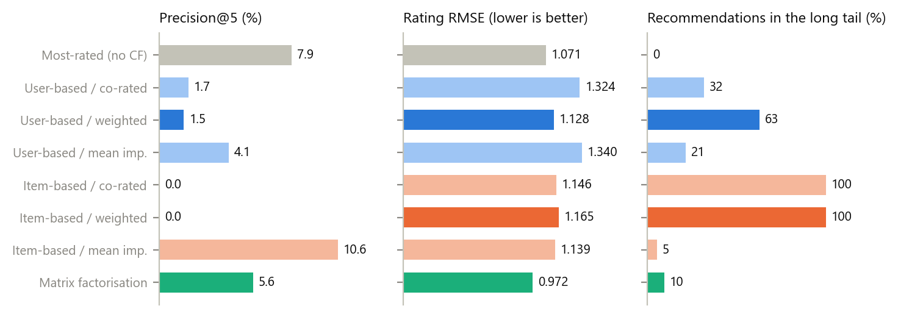
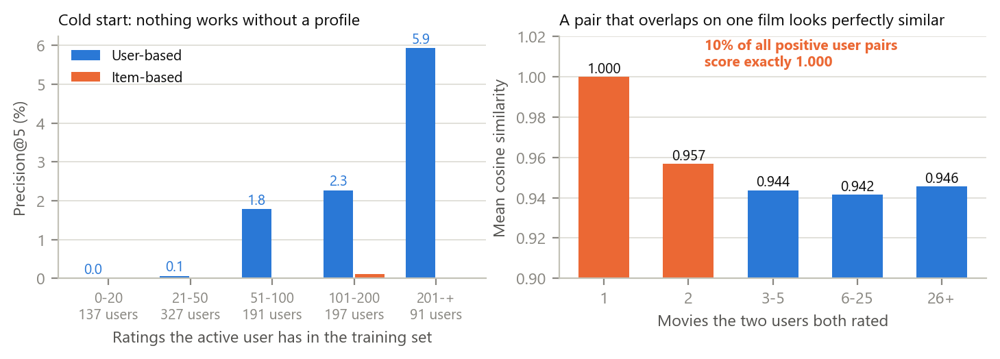
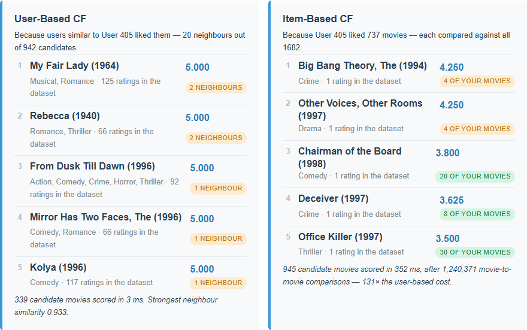

# Not the Similarity, the Evidence: User-Based vs Item-Based Collaborative Filtering on a 94% Empty Matrix

Student: Aleksei Kosychev &nbsp;&nbsp; Team: Individual 
Email: amkosychev@edu.hse.ru &nbsp;&nbsp; Date: 2026-09-29 
Assignment: A03 — Collaborative Filtering, MovieLens 100k (Week 3)

## Abstract

The Week 3 starter is a skeleton with four TODO stubs: the rating matrix, the cosine similarity, and
both recommenders. I filled them in, declared *significance weighting* as the missing-value strategy,
and measured what each choice is worth on a per-user temporal split of MovieLens 100k. **User-based
wins on both axes at once** here: with 1,682 movies against 943 users the item side has 3.2× more pairs
and costs 173× more per request in the browser (4 ms vs 624 ms), and it is also the worse recommender
under every co-rated strategy. **The specified formulas lose to not personalising at all** — a
most-rated list reaches Precision@5 of 7.9%, user-based 1.5%, item-based 0.0% — and the cause is
evidence, not the similarity: requiring 10 ratings behind a prediction instead of 1 lifts user-based to
8.4% and cuts RMSE from 1.128 to 0.980, at the price of prediction coverage falling from 77.5% to 18.5%.
**Mean imputation barely computes a similarity at all**: it squeezes every user pair into a band
1.7×10⁻⁴ wide around 0.99, 61× narrower than co-rated cosine, so the neighbour cut is decided by
floating-point noise, and its apparent Top-5 quality comes from collapsing onto the popular head.
Finally, 10.1% of all positive user pairs score *exactly* 1.000, with a median of one co-rated film.
Three data bugs in the starter were fixed along the way.

*Index Terms* — collaborative filtering, cosine similarity, sparsity, cold start, significance weighting, MovieLens

## 1. Introduction

**Problem statement.** The course provides a prompt and a four-file skeleton in which
`buildRatingMatrix()`, `cosineSimilarity()`, `getUserBasedRecommendations()` and
`getItemBasedRecommendations()` are empty TODO stubs [1]. The assignment asks to (i) implement
similarity over users (columns) and items (rows), (ii) choose one missing-value strategy for the sparse
matrix, and (iii) analyse user-based against item-based quality and efficiency, the trade-off between
missing-value strategies, and why CF fails for new users and items and for similarities computed from
very few co-rated items. The dataset is deliberately the same MovieLens 100k as Week 2 — byte-identical
files — so the algorithm is the only thing that changes.

**Concrete example.** User 405, the heaviest rater in the dataset with 737 ratings. User-based returns
five films all predicted at exactly 5.000, three of them backed by a *single* neighbour. Item-based
returns five films that have **one rating each in the entire dataset** — Big Bang Theory (1994),
Other Voices Other Rooms (1997), Chairman of the Board (1998) — and takes 624 ms to do it against the
user-based column's 4 ms (Fig. 3).

**Contributions.** (i) Both recommenders, three missing-value strategies and a deterministic tie-break,
as pure functions that a NumPy port reproduces number for number. (ii) A sparse formulation — including a
closed form for the imputed part of mean imputation — algebraically identical to the readable dense
definition and 15× faster, with a browser test comparing the two. (iii) An offline evaluation on a
temporal split answering the three analysis questions with numbers, including a popularity baseline that
beats most of the specified configurations. (iv) Three bugs fixed in the starter's data layer: the
19-flag genre off-by-one carried over from Week 2, the CRLF-truncated last field, and `u.item` being
decoded as UTF-8 when it is ISO-8859-1.

## 2. Related Work

Sources: the course starter [1]; MovieLens 100k and its README for the file layout [2], [3]; Herlocker
et al. for user-based neighbourhood CF and significance weighting, which is the `weighted` strategy used
here [4]; Sarwar et al. for item-based CF [5]; Koren et al. for matrix factorisation [6]; Cremonesi et al.
for the point that RMSE and Top-N ranking are different problems and that a popularity baseline is the
one every recommender must actually beat [7]; Playwright [8].

**Alternatives considered.** *Mean-centred (Pearson) prediction* is the standard improvement over a plain
weighted average, but the specification asks for the weighted average and the point here is to measure
the specified design. *Item neighbourhood restriction* (aggregating over only the *k* most similar rated
movies) is measured in Section 4 as a fix rather than adopted, since it changes the formula. *Matrix
factorisation in the browser* needs a training pass (46 s here), so it stays offline as the reference
point for the "advanced technique" row of the lecture's table.

## 3. Method

**Structures.** `ratingMatrix` is the dense `(numUsers + 1) × (numMovies + 1)` grid the specification
asks for, indexed by raw id, with `0` meaning "not rated" — MovieLens ratings are 1–5, so `0` is
unambiguous. Alongside it, `model` holds the same data as sparse per-row lists plus per-row count, sum,
sum of squares and mean. The dense grid is 94% empty, so any full scan spends 94% of its time on
nothing: item-based CF measured 5.5 s per request over the dense matrix (14.3 s for the heaviest user)
and 0.3 s over the sparse one.

**Similarity.** `cosineSimilarity(a, b, options)` is the readable definition on two dense vectors;
`similaritiesAgainstAll(primary, cross, x, stats, options)` is the fast path, and the two must agree
exactly. For user-based CF `primary` is the user index and `cross` the item index; for item-based CF the
two swap — that swap is the entire difference between the algorithms. Under `mean` the missing entries
still have to count, so their contribution is written in closed form from the per-row totals instead of
being scanned. The browser test confirms the two paths agree to 3×10⁻⁸ over all three strategies and
both directions.

**Missing values.** The declared strategy is `weighted`: co-rated cosine damped by `min(n, γ)/γ` with
`γ = 25` [4]. Two users who agree on two films score 1.0 under plain cosine, and two films are not
evidence. `corated` (plain co-rated cosine) and `mean` (row-mean imputation, cosine over the full vector)
are implemented so the comparison the assignment asks for can be reproduced from the UI; a run uses
exactly one and never mixes them.

**Prediction and ranking.** User-based keeps the `N = 20` most similar users with positive similarity and
predicts the similarity-weighted average of their ratings; item-based accumulates every rated movie's
similarity to each candidate, weighted by the user's rating. Both report **evidence** — how many ratings
the average was taken over. Predicted ratings land on a coarse grid (one neighbour who rated a film 5
predicts exactly 5.000), so ranking is by score, then evidence, then id; without that the visible Top-5
would depend on array order.

**Bug fixes in the starter.** (i) Fields 5–23 of `u.item` are *19* flags, `[unknown, Action, …, Western]`,
but the starter zips them against 18 genre names, shifting every label by one (Toy Story is stored as a
*Crime* film) and dropping Western. (ii) Splitting on `'\n'` leaves a `\r` on the last field after a
Windows checkout rewrites the files to CRLF. (iii) `u.item` is ISO-8859-1, but `Response.text()` always
decodes as UTF-8, so 30-odd accented titles arrive as replacement characters; the fix reads an
`arrayBuffer()` and decodes with `TextDecoder('iso-8859-1')`. CF never reads genres, but the app shows
them, and the titles are what the user sees.

**Tools.** Vanilla HTML/CSS/JS, no framework or build step; Python 3.12 with NumPy 2.3 and Matplotlib 3.10
offline; Playwright 1.58 driving Google Chrome 152 headless; Claude Code 2.1.278 with Claude Opus 5.

## 4. Experiments

**Setup.** MovieLens 100k: 943 users × 1,682 movies = 100,000 ratings, a matrix 5.0% full. Per user the
most recent 20% of their ratings is held out, giving 80,000 training and 20,000 test ratings; a held-out
rating of 4 or 5 counts as relevant, which leaves 907 users with something to find. Reported per model:
RMSE and prediction coverage over the test ratings it can score, hit-rate and Precision@5 over the Top-5,
the share of recommendations outside the 20% most-rated head, and how much of the catalogue is ever
recommended.

**Result 1 — the cost and quality of the two directions both favour users here.**

| | Rows compared | Pairs | Similarity matrix | Offline | In the browser |
|---|---|---|---|---|---|
| User-based | 943 users | 444,153 | 3.4 MB | 0.07 s | **4 ms** per request |
| Item-based | 1,682 movies | 1,413,721 (**3.2×**) | 10.8 MB | 0.11 s | **624 ms** per request |

The lecture's rule is that item-based pays off when there are more users than items. MovieLens 100k is
the other way round, and the measurement follows: the item side has 3.2× the pairs, 3.2× the memory, and
in the browser — where only the active user's rated movies are compared, not the whole matrix — 173× the
latency, because each of the user's 737 movies must be scored against all 1,682.

<em>Fig. 1. Every configuration on the same temporal split. Only item-based with mean imputation beats
the non-personalised most-rated list on Precision@5, and it does so by recommending almost nothing
outside the popular head.</em>

| Model | RMSE | Pred. coverage | Hit-rate@5 | Precision@5 | Long tail | Catalogue |
|---|---|---|---|---|---|---|
| Most-rated (no CF) | 1.071 | 99.6% | **28.4%** | **7.9%** | 0.0% | 2.6% |
| User-based / co-rated | 1.324 | 22.8% | 7.8% | 1.7% | 31.7% | 23.2% |
| User-based / weighted | 1.128 | 77.5% | 6.0% | 1.5% | **62.8%** | **30.2%** |
| User-based / mean imputation | 1.340 | 33.7% | 18.3% | 4.1% | 21.5% | 13.0% |
| Item-based / co-rated | 1.146 | 99.6% | 0.1% | 0.0% | 100.0% | 13.3% |
| Item-based / weighted | 1.165 | 99.6% | 0.1% | 0.0% | 100.0% | 13.5% |
| Item-based / mean imputation | 1.139 | 99.6% | **36.4%** | **10.6%** | 5.5% | 22.9% |
| Matrix factorisation (k=20) | **0.972** | 100.0% | 20.6% | 5.6% | 9.7% | 6.5% |

**Result 2 — the missing-value strategies trade three different things.** `corated` is the simplest and
the most biased: it will call two users identical on the strength of one shared film, so the 20 selected
neighbours are often the 20 users with the *least* overlap, and only 22.8% of test ratings can be
predicted at all. `weighted` fixes exactly that — the same neighbours, damped by how much they overlap —
raising coverage to 77.5% and cutting RMSE to 1.128, the best of the co-rated family. `mean` is the
cheapest to state and the hardest to defend: replacing 94% of each vector with one constant makes every
pair look alike, and across user 1's top 20 neighbours the similarity spread is 1.7×10⁻⁴ against
co-rated cosine's 1.1×10⁻², **61× narrower**. What is left is mostly popularity, which is why its Top-5
looks good (10.6% Precision@5 item-based) while only 5.5% of its recommendations come from outside the
head. Matrix factorisation is the accurate and expensive one: RMSE 0.972 at full coverage, for 46 s of
training against 0.07 s to build a similarity matrix.

Significance weighting has its own trade-off. Sweeping γ for user-based CF, RMSE falls monotonically
(1.324 at γ=1 to 1.107 at γ=100) while Precision@5 peaks early and then collapses (1.7% → 3.9% at γ=5 →
0.4% at γ=100). γ=25 buys coverage and rating accuracy; a deployment tuned for the ranked list would
pick γ≈5. The two objectives do not agree, which is Cremonesi's point [7].

**Result 3 — what fails is the amount of evidence, not the formula.**

| Minimum ratings behind a prediction | 1 | 3 | 5 | 10 |
|---|---|---|---|---|
| User-based RMSE | 1.128 | 1.038 | 1.009 | **0.980** |
| User-based Precision@5 | 1.5% | 3.2% | 5.3% | **8.4%** |
| Prediction coverage | **77.5%** | 53.2% | 39.4% | 18.5% |
| Recommendations in the long tail | 62.8% | 28.3% | 9.0% | 1.6% |

Nothing about the similarity changes across that table; only the requirement that a prediction rest on
more than one rating. It takes user-based from well below the popularity baseline to just above it — and
takes the long tail from 62.8% to 1.6%, so the accuracy is bought by retreating to the head.

Item-based needs the mirror-image guard, on the candidate rather than the neighbours. Restricting
candidates to movies with at least 25 training ratings moves item-based Precision@5 from 0.0% to 1.1%,
and aggregating over only the 20 most similar rated movies instead of all of them moves it to 1.6% with
catalogue coverage of 56.7% — the broadest of any configuration measured, and still a quarter of the
popularity baseline's precision.

<em>Fig. 2. Left: Precision@5 against how much the active user has rated — CF has nothing to say to the
137 users with 20 ratings or fewer. Right: mean similarity against how many films the pair actually
shares. The thinner the evidence, the higher the score.</em>

**Result 4 — cold start and sparsity, measured.** 69 movies have no training rating at all and 443 (26.3%
of the catalogue) have fewer than five, so a quarter of the catalogue cannot be reached by any
neighbourhood method. On the user side, Precision@5 is 0.0% for the 137 users with at most 20 ratings and
rises monotonically to 5.9% for the 91 users with more than 200. On the pair side, of the 418,472 user
pairs with positive similarity, 17.0% rest on at most two co-rated films and **10.1% score exactly
1.000, with a median of one co-rated film**. Mean similarity *falls* with evidence — 1.000 at one shared
film, 0.957 at two, 0.942 at 6–25 — so a plain ranking by similarity is, in its top ranks, a ranking by
ignorance.

<em>Fig. 3. Left: the starter, whose four stubs return nothing. Right: the finished app for user 405 —
five predictions of exactly 5.000 backed by one or two neighbours, and an item-based column of films with
a single rating each, at 173× the cost.</em>

**Verification.** `tests/check_cf.py` serves the app over http, drives it in headless Chrome and runs 36
checks, all passing: the sparse similarity equals the dense definition to 3×10⁻⁸ for all three strategies
in both directions; both Top-5 columns match the NumPy reference exactly for all 24 `corated` and
`weighted` configurations; the `mean` configurations are checked numerically instead, because the 1.7×10⁻⁴
spread makes the neighbour cut genuinely unstable between float32 implementations; the evidence threshold
is enforced; accented titles survive the ISO-8859-1 decode; and the starter still reports Toy Story as
`Children's, Comedy, Crime` and returns "Implement the TODO above".

## 5. Discussion

**Answers to the three analysis questions.**

- *User-based vs item-based.* On MovieLens 100k, user-based, on both counts: items outnumber users
  1,682 to 943, so the item-item space is 3.2× larger and the browser pays 173× more latency, and
  quality points the same way under every co-rated strategy. The lecture's rule is about the ratio, not
  the method — at Amazon's shape it reverses, and item-based also wins on stability, since a movie's
  rating column changes far more slowly than a user's row. What never reverses is that item-item
  similarity can be precomputed offline while a user neighbourhood cannot, which is the real reason the
  industry standard [5] is item-based even where items outnumber users.
- *Missing-value strategy.* Use co-rated entries with significance weighting. Plain co-rated cosine is
  simplest but is exactly the strategy that manufactures perfect similarity out of one shared film;
  weighting costs one extra multiplication and repairs prediction coverage from 22.8% to 77.5%. Mean
  imputation is the one to avoid in this shape of data: it is cheap and it looks good on a ranked list,
  but it compresses all similarities into a 10⁻⁴ band, so it has stopped measuring taste and started
  measuring popularity. Matrix factorisation is the accurate answer and costs a training pipeline —
  worth it when there is one, not worth it for a static page.
- *Cold start and sparsity.* With a matrix 5% full, a similarity between two users is an estimate from a
  handful of observations, and the estimator is most confident exactly where it has least data. Hence a
  new user gets nothing (0.0% Precision@5 below 20 ratings), a quarter of the catalogue is unreachable,
  and the fix is an evidence floor rather than a better formula. Commercially that floor is the choice
  between covering the catalogue and being right: at 1 rating of evidence 62.8% of recommendations are
  long-tail and almost none are useful; at 10 the precision beats popularity but 98.4% of what is shown
  is already a hit.

**Failure case and root cause.** The specified predictors are weighted *averages*, and an average is
invariant to any factor applied uniformly to its weights. Significance weighting therefore only bites
where it changes *which* neighbours are selected — user-based has such a selection step, item-based does
not, which is why weighting improves user-based coverage by 55 points and does nothing for item-based.
An obscure film co-rated by one enthusiast inherits that enthusiast's 5 however hard the similarity is
damped: the guard has to be on the count, not the weight.

**What worked.** Writing the readable dense definition first and the sparse one second, then having the
browser test compare them, made a 15× speed-up safe to adopt; it also caught the ISO-8859-1 bug, because
NumPy and the page disagreed on one title. Printing the evidence beside every prediction changed how the
app reads: "5.000" and "5.000 from one neighbour" are not the same claim.

**What surprised me.** That a non-personalised most-rated list beats almost every configuration in the
specification, and that the one which beats it does so by imitating it. And that mean imputation's
similarities are numerically unstable enough for the browser and NumPy to disagree on the neighbour set —
I expected a bias, not a loss of resolution.

**Next improvement.** Mean-centre the ratings before averaging. Much of the error here is that users
disagree about what "4" means, and the co-rated cosine of two raw rating vectors is dominated by both
being positive numbers around 3.5 — which is also why every similarity sits above 0.9 to begin with.

## 6. AI Usage Disclosure

**AI tools used.** Claude Code 2.1.278 (VS Code extension), model Claude Opus 5, one session.

**How AI was used.** *Search / reading:* cloning [1] and reading `week3/`; the `u.item` layout in [3].
*Code generation:* `cf.js`, the rewritten `data.js` / `script.js` / `index.html` / `style.css`,
`experiments/run_experiment.py`, `experiments/make_figures.py`, `tests/check_cf.py`, and the corrected
`prompt.md`. *Analysis:* running the offline evaluation and the browser test, and drafting this report.

**What I personally verified.**

TODO (to be completed before submission): run <code>python -m http.server</code> in <code>hw3/</code>, open
<code>starter/index.html</code> and confirm it returns "Implement the TODO above"; open
<code>index.html</code>, reproduce the user 405 columns of Fig. 3 and the 4 ms / 624 ms split; switch the
strategy to mean imputation and confirm the item-based column turns into well-known films; re-run
<code>tests/check_cf.py</code> and confirm 36/36.

**What I trusted without verification.** That the MovieLens timestamps order each user's ratings
correctly, since the whole split depends on them; that 30 SGD epochs are enough for the matrix
factorisation baseline to be a fair reference point rather than an undertrained one.

**Session log.** `kosychev_a03_session.json` is the unmodified Claude Code log of this work.

## References

[1] S. Jin, "RecSys-LLMs: Recommender Systems course repository (week3)," GitHub, commit `c00cfa1`, 2026. [Online]. Available: https://github.com/dryjins/RecSys-LLMs/tree/main/week3. [Accessed: 2026-09-29].

[2] F. M. Harper and J. A. Konstan, "The MovieLens Datasets: History and Context," *ACM Trans. Interact. Intell. Syst.*, vol. 5, no. 4, pp. 1–19, 2015.

[3] GroupLens Research, "MovieLens 100K Dataset (README: `u.item`, `u.data`)," University of Minnesota. [Online]. Available: https://grouplens.org/datasets/movielens/100k/. [Accessed: 2026-09-29].

[4] J. L. Herlocker, J. A. Konstan, A. Borchers, and J. Riedl, "An Algorithmic Framework for Performing Collaborative Filtering," in *Proc. 22nd ACM SIGIR*, 1999, pp. 230–237.

[5] B. Sarwar, G. Karypis, J. Konstan, and J. Riedl, "Item-Based Collaborative Filtering Recommendation Algorithms," in *Proc. 10th Int. Conf. World Wide Web (WWW)*, 2001, pp. 285–295.

[6] Y. Koren, R. Bell, and C. Volinsky, "Matrix Factorization Techniques for Recommender Systems," *Computer*, vol. 42, no. 8, pp. 30–37, 2009.

[7] P. Cremonesi, Y. Koren, and R. Turrin, "Performance of Recommender Algorithms on Top-N Recommendation Tasks," in *Proc. 4th ACM Conf. Recommender Systems (RecSys)*, 2010, pp. 39–46.

[8] Microsoft, "Playwright for Python — Installation," Playwright Docs. [Online]. Available: https://playwright.dev/python/docs/intro. [Accessed: 2026-09-29].
